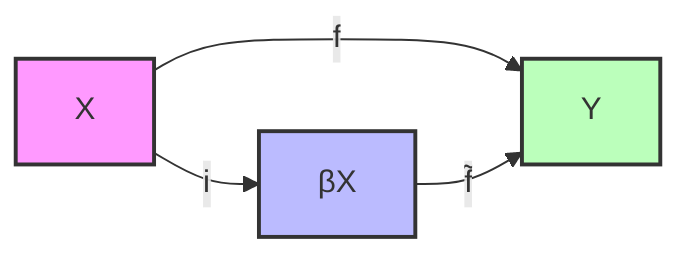
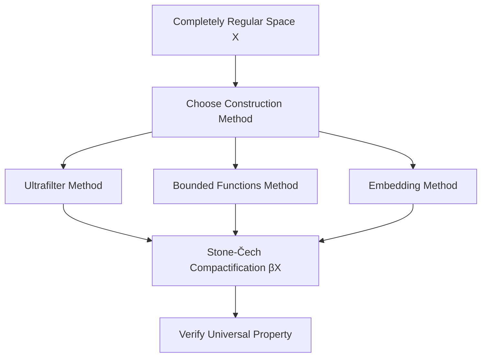

# Stone-Čech Compactification

The Stone-Čech compactification is a fundamental construction in topology that allows us to embed any completely regular topological space into a compact Hausdorff space in a "universal" way.

## Definition and Properties

Let X be a completely regular topological space (meaning it's Hausdorff and points can be separated from closed sets by continuous functions). The Stone-Čech compactification, denoted by βX, is a compact Hausdorff space with the following properties:

1. There exists a continuous embedding i: X → βX such that i(X) is dense in βX.

2. Universal property: For any continuous function f: X → Y, where Y is a compact Hausdorff space, there exists a unique continuous extension f̃: βX → Y such that f̃ ∘ i = f.

This universal property is what makes the Stone-Čech compactification so powerful. It essentially says that any continuous map from X to a compact Hausdorff space can be "factored through" βX.

## Construction Methods

There are several ways to construct βX:

1. **Using the universal property**: Define βX as the set of all ultrafilters on X, with a suitable topology.

2. **Using the algebra of bounded continuous functions**: βX can be realized as the maximal ideal space of the C*-algebra C_b(X) of all bounded continuous functions from X to ℂ.

3. **Using embeddings**: Embed X into a product of unit intervals [0,1]^I for some index set I, and take the closure of the image.

## Applications

The Stone-Čech compactification has many applications in topology, functional analysis, and even number theory. For instance:

- When X is discrete, βX is extremely large and has a rich combinatorial structure.
- For X = ℕ, the space βℕ \ ℕ plays a key role in combinatorial number theory.
- In functional analysis, βX is the spectrum of the C*-algebra of bounded continuous functions on X.

## Key Insight

A key insight is that βX adds "points at infinity" to X in just the right way to make it compact while preserving its topological structure.

## Mathematical Diagram

Where:
- X is a completely regular space
- βX is its Stone-Čech compactification
- Y is any compact Hausdorff space
- i is the embedding of X into βX
- f is any continuous map from X to Y
- f̃ is the unique extension of f to βX

